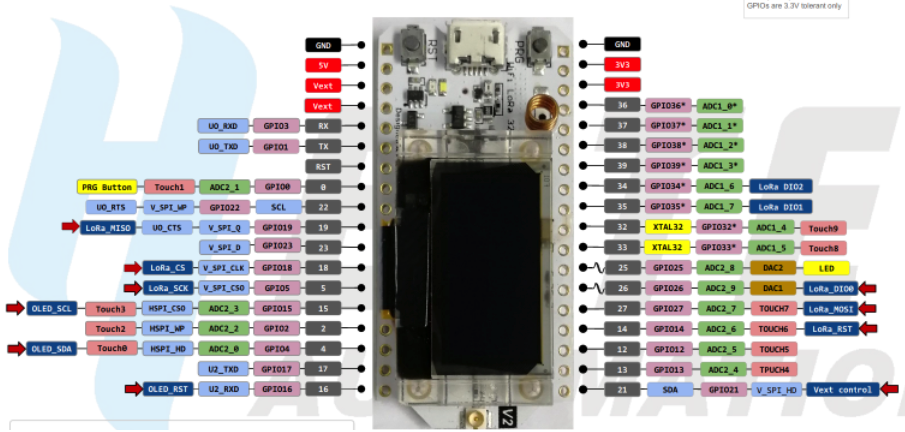

# Heltec ESP32+LoRa + BMP085

### Firsts steps to install? ###

1 - Install Visual Studio Code

2 - Install PlataformIO from Visual Studio Code Extensions

2 - Install heltec_wifi_lora_32_V2 board

3 - Install adafruit/Adafruit BMP085 Library@^1.2.1 Library from PlataformIO Librairies

4 - clone repo from github https://github.com/marciogarridoLaCop/Lora

marciogarrido@id.uff.br